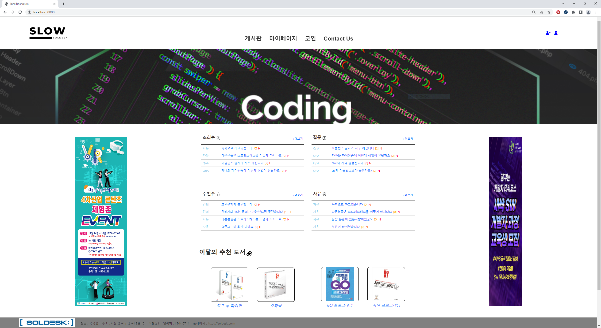

# JungInSung_Portfolio_2022
신입 웹 개발자로 구직 중인 정인성입니다. 
팀 프로젝트에서 제가 담당했던 역할과 설명을 위한 이미지를 첨부했습니다 
 
## 1. 모바일 쿠폰 중고 거래 사이트 (CouponBook)
해당 프로젝트에서 저는 팀장을 맡았습니다. 

메인 페이지에서는 상품의 썸네일을 제공하고 상세페이지에서는 원본이미지를 제공하기 위해 

상품등록 시 상품권사진첨부에서 이미지 파일만 등록할 수 있도록 파일종류를 검증하도록 했으며 
이미지 파일이 맞다면 자동으로 원본이미지 파일과 썸네일용이미지파일을 만들도록 구현했습니다. 

1대1 채팅 대신 상세페이지 하단에서 1대1 거래를 위한 댓글과 대댓글을 구현했습니다. 
판매자는 댓글을 작성한 모든 이의 댓글을 확인 할 수 있고 
구매자는 자신과 판매자만의 댓글을 볼 수 있습니다. 

아이디와 비밀번호를 잃어버렸을 때 찾기 위한 페이지입니다. 
비밀번호 찾기는 가입당시 입력한 개인정보를 확인한 뒤 비밀번호를 초기화하는 방식을 사용했습니다. 

그 외 오라클 클라우드 데이터베이스를 사용하여 협업하는 동안 한 팀원이 데이터베이스를 수정하더라도 
수정한 코드를 카톡이나 메신저앱을 통해 전달받아서 다른팀원들이 직접 수정하는 수고를 하지않도록했으며 
오라클 클라우드 인스턴스(Ubuntu), putty, FileZilla 를 사용해서 서버를 만든 뒤  
가비아 도메인에서 도메인을 구입하여 CouponBook.shop으로 배포해보았습니다.   

## 2. 개발자 커뮤니티 (SLOW)
해당 프로젝트는 팀원이 총 3명이었고 Front,Back 나누지 않고 자신이 맡은 역할을 스스로 구현했습니다. 

저는 팀원으로 사이트 내 자체 통화(Coin)구현과 관리자페이지 시각화차트를 구현했습니다. 

Coin 충전은 아임포트API의 카카오페이충전을 사용했으며  
데이터베이스에 결제금액과 결제시간, 아임포트에서 제공하는 ID값 등을 삽입하도록 했습니다  

환불은 충전당시 입력된 아임포트API의 ID값을 이용해서 결제 건별로 환불되도록 했으며 
결제수수료를 10%로 가정하여 결제 금액중 90%만 환불되도록했습니다. 

사이트 내에서 활동하여 타인으로부터 코인을 받거나 계급이 상승했을 때  
추가로 코인을 얻을 수 있으며 이로인한 코인들은 환전을 할 수 있게 하였습니다. 
환전 신청시 즉시 자신의 계좌로 금액이 입금되는게 아닌 환전신청으로 
이 부분은 금융결제원오픈API를 사용해서 환전버튼을 누르면 금융결제원에서 토큰을 발급받고 
사용자가 입력한 성명,은행,계좌번호,주민등록번호6자리를 입력해서 실제계좌 확인 후 
관리자에게 환전신청메일이 전송되도록 구현했습니다. 

기록페이지에서는 자신의 Coin기록을 보여주도록 했습니다.
 
 

관리자페이지에서 시각화차트를 구현한 모습입니다. 
Chart.js 와 HighChart.js 를 사용해서 차트를 그렸고  
토글버튼으로 2개의 라이브러리를 교차해서 보여주도록 했습니다. 

구글 데이터스튜디오(루커스튜디오)를 사용한 시각화 차트입니다. 
관리자페이지 접속시 통계자료를 csv 파일로 만들도록한뒤 
담당자가 직접 데이터스튜디오에서 최신화하도록 구현했습니다. 
## 3. 프로젝트에서 사용한 기술스택과 포트폴리오 통합이미지

